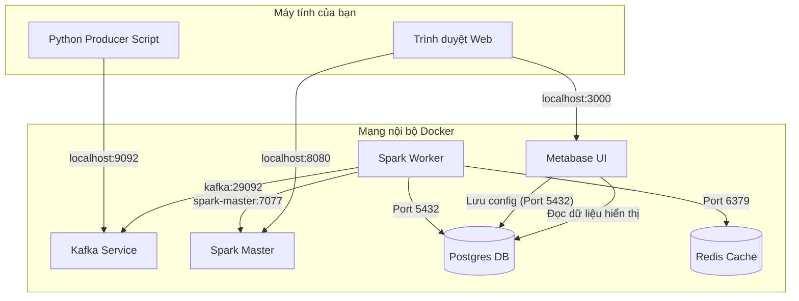

Chào bạn, bộ file cấu hình của bạn đang xây dựng một hệ thống **Real-time Data Pipeline** (Đường ống dữ liệu thời gian thực) khá tiêu chuẩn.

Hệ thống này bao gồm: **Kafka** (thu thập dữ liệu), **Spark** (xử lý dữ liệu), **Redis** (cache/lưu trữ nhanh), **Postgres** (lưu trữ quan hệ) và **Metabase** (trực quan hóa).

Dưới đây là giải thích chi tiết, sơ đồ hoạt động và hướng dẫn cách chạy workflow.

---

### 1. Giải thích chi tiết từng file

#### A. File `dockerfile.spark`

File này dùng để tự "đóng gói" một môi trường Spark riêng (Custom Image) thay vì dùng bản gốc, nhằm cài thêm các thư viện cần thiết.

* `FROM apache/spark:latest`: Sử dụng ảnh nền Spark mới nhất.
* `ENV HOME=/home/spark ...`: Thiết lập thư mục home và quyền sở hữu (User ID 185 là user mặc định của Spark container). Điều này giúp tránh lỗi permission khi Spark ghi file tạm (Ivy cache).
* `RUN apt-get ... pip3 install ...`:
* Cài đặt Python và PIP.
* **Quan trọng:** Cài các thư viện `pyspark` (để code Spark bằng Python), `kafka-python` (để tương tác Kafka nếu không dùng Spark Streaming native), `redis` (kết nối Redis), `pandas` (xử lý dữ liệu dạng bảng nhỏ).


* `WORKDIR /app`: Thư mục làm việc mặc định khi container chạy.

#### B. File `docker-compose.yml`

File này định nghĩa cách các dịch vụ (services) chạy và kết nối với nhau.

**1. Cụm Spark (Processing)**

* **`spark-master`**: "Bộ não" điều phối cluster.
* Mở port `7077`: Để Worker kết nối vào.
* Mở port `8080`: Web UI để bạn xem trạng thái cluster.
* Volumes `- ./:/app`: **Rất quan trọng**. Nó ánh xạ thư mục hiện tại của máy bạn vào thư mục `/app` trong container. Bạn sẽ để file code `.py` ở ngoài máy thật, và container sẽ đọc được nó ngay lập tức.


* **`spark-worker`**: Nơi thực sự xử lý dữ liệu.
* `command`: Lệnh để đăng ký với Master (`spark://spark-master:7077`).
* `depends_on`: Chỉ chạy khi Master đã khởi động.


**2. Kafka (Ingestion - Kraft Mode)**

* Dùng chế độ **Kraft** (không cần Zookeeper), giúp hệ thống nhẹ hơn.
* **Cấu hình mạng (Listeners) - Phần này hay gây lỗi nhất:**
* `EXTERNAL://0.0.0.0:9092`: Cho phép máy thật (Host) của bạn gửi dữ liệu vào Kafka qua `localhost:9092`.
* `INTERNAL://0.0.0.0:29092`: Cho phép các container khác (như Spark) kết nối với Kafka qua tên service `kafka:29092`.
* `KAFKA_ADVERTISED_LISTENERS`: Đây là địa chỉ mà Kafka "quảng cáo" cho client. Nếu client là Spark (trong Docker), nó dùng `INTERNAL`. Nếu client là script chạy trên máy bạn, nó dùng `EXTERNAL`.


**3. Database & Visualization**

* **`postgres`**: Cơ sở dữ liệu quan hệ.
* Trong file này, Postgres đang được dùng làm **Backing Store cho Metabase** (lưu user, cấu hình dashboard của Metabase) thông qua các biến môi trường `MB_DB_...` ở service Metabase.
* Tuy nhiên, bạn cũng có thể dùng nó để Spark ghi dữ liệu đã xử lý vào.


* **`redis`**: Database in-memory. Spark có thể ghi dữ liệu nóng vào đây hoặc dùng để cache.
* **`metabase`**: Công cụ vẽ biểu đồ.
* Cấu hình `MB_DB_HOST: postgres` nghĩa là Metabase sẽ lưu dữ liệu cấu hình của chính nó vào container Postgres kia.


---

### 2. Sơ đồ minh họa liên kết (Architecture Diagram)

Hệ thống hoạt động theo luồng dữ liệu (Data Flow) như sau:

Dưới đây là sơ đồ chi tiết các kết nối mạng trong Docker của bạn:



**Giải thích luồng đi:**

1. **Producer (Ngoài máy thật):** Gửi log/data vào Kafka qua cổng `9092`.
2. **Consumer (Spark Worker):** Đọc data từ Kafka qua cổng nội bộ `29092`, xử lý (clean, aggregate).
3. **Sink (Lưu trữ):** Spark ghi kết quả xuống Postgres hoặc Redis.
4. **Visualization:** Metabase đọc dữ liệu từ Postgres để hiển thị lên Dashboard (truy cập qua `localhost:3000`).

---

### 3. Cách chạy Services đúng Workflow (Producer & Consumer)

Để chạy hệ thống này mượt mà, bạn làm theo các bước sau:

#### Bước 1: Build và Khởi chạy hệ thống

Vì bạn dùng `image: spark-custom` nhưng chưa build, bạn phải build trước:

```bash
# 1. Build image Spark
docker build -t spark-custom -f dockerfile.spark .

# 2. Chạy toàn bộ services
docker-compose up -d

```

#### Bước 2: Chuẩn bị Producer (Gửi dữ liệu)

Producer nên chạy từ máy thật của bạn (để giả lập dữ liệu từ bên ngoài) hoặc một service riêng. Dưới đây là ví dụ Python script chạy trên máy thật.

*Tạo file `producer.py`:*

```python
from kafka import KafkaProducer
import json
import time
import random

# Lưu ý: Dùng localhost:9092 vì chạy từ máy host
producer = KafkaProducer(
    bootstrap_servers=['localhost:9092'],
    value_serializer=lambda x: json.dumps(x).encode('utf-8')
)

while True:
    data = {
        'sensor_id': random.randint(1, 10),
        'temperature': random.uniform(20.0, 35.0),
        'timestamp': time.time()
    }
    producer.send('sensor_topic', value=data)
    print(f"Sent: {data}")
    time.sleep(1)

```

*Cài thư viện và chạy:* `pip install kafka-python && python producer.py`

#### Bước 3: Chuẩn bị Consumer (Spark Job)

File này sẽ chạy **bên trong** container Spark, nên cấu hình kết nối mạng phải khác Producer.

*Tạo file `consumer_spark.py` tại thư mục cùng cấp với docker-compose:*

```python
from pyspark.sql import SparkSession
from pyspark.sql.functions import from_json, col
from pyspark.sql.types import StructType, StructField, IntegerType, DoubleType, FloatType

# Cấu hình Spark với gói Kafka
# Lưu ý: Cần tải gói spark-sql-kafka khi submit job
spark = SparkSession.builder \
    .appName("KafkaSparkStreaming") \
    .getOrCreate()

# Schema dữ liệu
schema = StructType([
    StructField("sensor_id", IntegerType()),
    StructField("temperature", DoubleType()),
    StructField("timestamp", FloatType())
])

# 1. Đọc từ Kafka
# LƯU Ý QUAN TRỌNG: Dùng 'kafka:29092' (tên service trong docker-compose)
df = spark.readStream \
    .format("kafka") \
    .option("kafka.bootstrap.servers", "kafka:29092") \
    .option("subscribe", "sensor_topic") \
    .option("startingOffsets", "earliest") \
    .load()

# 2. Parse dữ liệu JSON
parsed_df = df.select(from_json(col("value").cast("string"), schema).alias("data")).select("data.*")

# 3. Xử lý (Ví dụ in ra console)
# Trong thực tế, bạn sẽ writeStream xuống Postgres hoặc Redis
query = parsed_df.writeStream \
    .outputMode("append") \
    .format("console") \
    .start()

query.awaitTermination()

```

#### Bước 4: Submit Spark Job

Bạn không chạy `python consumer_spark.py` trực tiếp trên máy thật. Bạn phải gửi nó vào Spark Master container.

Chạy lệnh sau từ terminal máy thật:

```bash
docker exec -it spark-master /opt/spark/bin/spark-submit \
  --packages org.apache.spark:spark-sql-kafka-0-10_2.12:3.5.0 \
  /app/consumer_spark.py

```

**Giải thích lệnh:**

* `docker exec -it spark-master`: Vào container master.
* `/app/consumer_spark.py`: Vì bạn đã volume mount `- ./:/app`, file này đã có sẵn trong container.
* `--packages ...`: Spark cần tải driver Kafka về mới đọc được (quan trọng). *Lưu ý: Version 3.5.0 phải khớp với version Spark trong image `apache/spark:latest` (hiện tại thường là 3.4 hoặc 3.5).*

### Tổng kết workflow

1. Chạy `docker-compose up`.
2. Chạy `python producer.py` trên máy thật -> Dữ liệu vào Kafka (port 9092).
3. Chạy lệnh `spark-submit` -> Spark đọc Kafka (port 29092), xử lý và in ra log của container.

Nếu bạn gặp lỗi kết nối Kafka, 90% là do nhầm lẫn giữa `localhost:9092` và `kafka:29092`. Hãy tuân thủ quy tắc: **Ở ngoài dùng localhost, ở trong Docker dùng tên service.**