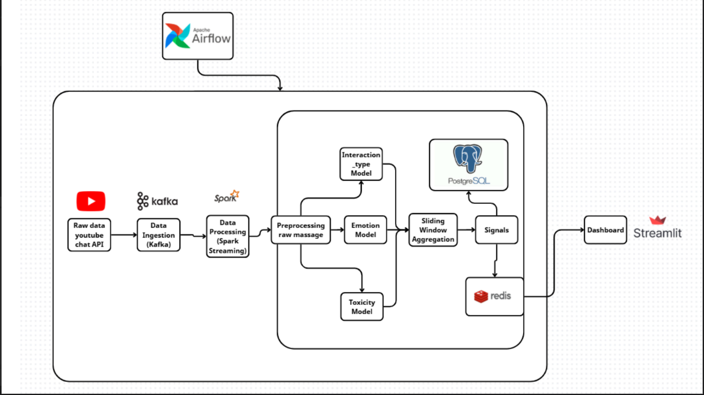
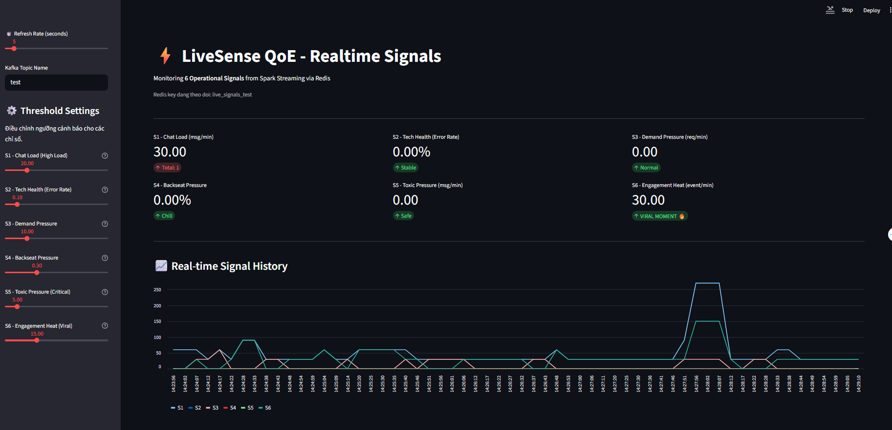

# ⚡ LiveSense QoE: Real-time Livestream Analytics & AI Moderation System

[](https://www.python.org/)
[](https://www.docker.com/)
[](https://spark.apache.org/)
[](https://kafka.apache.org/)
[](LICENSE)

> **"Turning Chaos into Insights"** — Hệ thống phân tích thời gian thực giúp Streamer và Moderator thấu hiểu khán giả, phát hiện toxic và nắm bắt khoảnh khắc viral ngay lập tức.

---

## 📖 Tổng quan dự án (Project Overview)

**LiveSense QoE** (Quality of Experience) là một giải pháp MLOps toàn diện được thiết kế để giải quyết bài toán quá tải thông tin trong các buổi livestream quy mô lớn. Thay vì để Streamer bị "trôi chat" hoặc Moderator phải căng mắt đọc từng dòng tin nhắn, hệ thống tự động thu thập, phân tích và chuyển đổi hàng ngàn tin nhắn mỗi giây thành các **Tín hiệu vận hành (Operational Signals)** trực quan.

### 🎯 Mục tiêu cốt lõi:
1.  **Real-time Monitoring:** Cung cấp Dashboard thời gian thực với độ trễ thấp (< 5s).
2.  **AI-Powered Moderation:** Tự động phát hiện và cảnh báo các cuộc tấn công ngôn từ (Toxic Attack).
3.  **Engagement Tracking:** Nhận diện khoảnh khắc "đỉnh cao" (Viral Moments) để hỗ trợ đội ngũ Editor.
4.  **Historical Analysis:** Lưu trữ dữ liệu dài hạn để phân tích xu hướng khán giả theo thời gian.

---

## 🏗️ 2. Kiến trúc hệ thống (System Architecture)



*Sơ đồ kiến trúc tổng thể luồng dữ liệu: Producer -> Kafka -> Spark Streaming -> Redis/PostgreSQL -> Dashboard/Metabase.*

### 📺 Dashboard Preview



*Giao diện giám sát real-time 6 tín hiệu vận hành từ Redis và Spark Streaming.*

### 🛠️ Tech Stack

| Layer | Technology | Purpose |
|-------|-----------|---------|
| **Ingestion** | Apache Kafka (KRaft mode) | Event streaming & message broker |
| **Processing** | Apache Spark 3.5+ (Structured Streaming) | Distributed stream processing with ML integration |
| **ML/AI** | ONNX Runtime, Transformers | Real-time toxicity & emotion classification |
| **Storage (Hot)** | Redis | In-memory cache for real-time dashboard |
| **Storage (Cold)** | PostgreSQL | Time-series data & historical analytics |
| **Visualization** | Streamlit, Metabase | Real-time dashboard & BI analytics |
| **Infrastructure** | Docker Compose | Containerized microservices orchestration |
| **Runtime** | Python 3.9+, PySpark | Data pipeline, transformations & ML inference |

---

## 📊 3. Hệ thống tín hiệu (The 6 Operational Signals)

Đây là "trái tim" của LiveSense, giúp định lượng cảm xúc và hành vi khán giả thành các con số biết nói.

| Signal | Tên gọi | Ý nghĩa & Ứng dụng | Công thức (Demo) |
| :--- | :--- | :--- | :--- |
| **S1** | **Chat Load** | **"Nhịp tim của Stream"**. Đo lường tốc độ tin nhắn đổ về. Giúp nhận biết độ "nóng" tổng quan của buổi live. | `Total_Msg / 60s` |
| **S2** | **Tech Health** | **"Bác sĩ kỹ thuật"**. Phát hiện khi người xem phàn nàn về lag, mất tiếng, drop frame. | `% Technical_Issue` |
| **S3** | **Demand Pressure** | **"Áp lực yêu cầu"**. Đo lường mức độ đòi hỏi của khán giả (yêu cầu chơi game khác, đổi nhạc...). | `Request_Count / 60s` |
| **S4** | **Backseat Pressure** | **"Chỉ số dạy đời"**. Đo lường mức độ khán giả chỉ trích hoặc chỉ đạo cách chơi game (Backseating). | `% Performance_Feedback` |
| **S5** | **Toxic Pressure** | **"Hệ thống an ninh"**. Cảnh báo ĐỎ khi xuất hiện làn sóng tấn công, chửi bới, xúc phạm. | `Toxic_Count / 60s` |
| **S6** | **Engagement Heat** | **"Máy dò Highlight"**. Nhận diện khoảnh khắc bùng nổ cảm xúc (Viral), hỗ trợ cắt clip highlight tự động. | `Excitement_Count / 60s` |

---

## 📚 Documentation

- Tài liệu chi tiết dự án: [docs/SE363_Q11.pdf](docs/SE363_Q11.pdf)
- Kiến trúc hệ thống: [ARCHITECTURE.md](ARCHITECTURE.md)

---

## 🚀 Installation & Usage

### Yêu cầu tiên quyết (Prerequisites):
*   Docker & Docker Compose
*   Python 3.9+
*   Git

### Bước 1: Khởi tạo môi trường hạ tầng
Dựng toàn bộ các services (Spark, Kafka, Redis, Postgres, Metabase) bằng Docker.

```bash
# Tại thư mục gốc dự án
copy .env.example .env
docker-compose up -d
```
*Chờ khoảng 30s - 1 phút để các container khởi động hoàn toàn.*

### Bước 2: Cài đặt thư viện Python (Client Side)
Cài đặt các thư viện cần thiết để chạy Producer và Dashboard ở máy local.

```bash
pip install kafka-python pandas streamlit redis
```

### Bước 3: Kích hoạt hệ thống (Theo thứ tự)

**1. Khởi chạy Spark Consumer (Bộ não xử lý):**
Consumer sẽ lắng nghe Kafka, xử lý dữ liệu và đẩy vào Redis/Postgres.
```bash
docker exec -it spark-master python3 /app/consumer.py --topic test --trigger-seconds 2
```

**2. Khởi chạy Streamlit Dashboard (Màn hình theo dõi):**
Mở một terminal mới:
```bash
streamlit run dashboard.py
```
*Truy cập: http://localhost:8501*

**3. Bắt đầu giả lập dữ liệu (Data Generator):**
Mở một terminal mới để bắn dữ liệu giả lập vào hệ thống:
```bash
python producer.py --video_id <youtube_url_or_id> --topic test --server localhost:9092
```

Lưu ý: Kafka topic ở Producer, Consumer và Dashboard phải giống nhau (ví dụ `test`).

---


